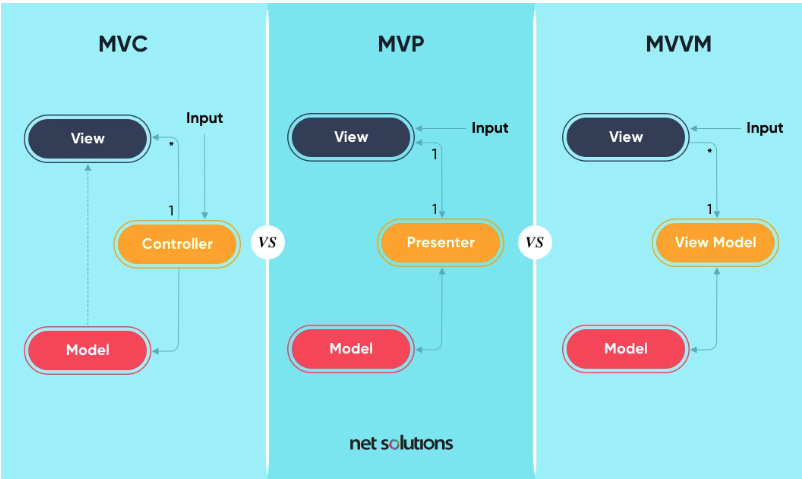

## 1. Model-View-Control (MVC)
MVC is common for web apps, libraries, and user interfaces.

- Model – the backend business logic and data
- View – the interface components to display the data
- Controller – Input is directed here first, processing the request through the model and passing it back to view

## 2. Model-View-Presenter (MVP)
MVP is commonly used for websites, web apps, and mobile apps (particularly Android)

- Model – the backend business logic and data
- View – input begins here and the requested action is presented here
- Presenter – One-to-one listening to the views and models, processing the request through the model and passing it back to view

## 3. Model view View-Model (MVVM)
MVVM is also commonly used for mobile apps (growing use in Android) where bi-directional data binding is important

- Model – the backend business logic and data
- View – input begins here and the requested action is presented here
- View-Model – has no reference to view, its only purpose is to maintain the state of view and manipulate the model as the actions of view change
